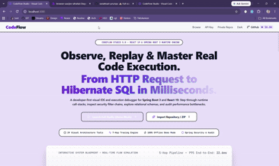

# CodeFlow Studio 🚀 (v2.3.0)
> **Understand Spring Boot + React codebases visually — without reading hundreds of files.**

[](file:///D:/Working/Projects/codeflow-studio/README.md)
[](file:///D:/Working/Projects/codeflow-studio/README.md)
[](https://spring.io/projects/spring-boot)
[](https://reactjs.org/)

---

## 🎬 Live Product Demonstration



> 💡 *Watch CodeFlow Studio in action: Tracing feature-segregated execution flows, dynamic endpoint parsing, claymorphic HLD architecture canvas, and interactive 5-mode File Tree Explorer.*

---

## 💡 Problem → Solution

| ❌ The Problem | ✅ The CodeFlow Solution |
| :--- | :--- |
| Developers spend hours jumping between hundreds of files trying to figure out how a feature works. | **Instant Visual Mapping**: Import any repo and immediately see end-to-end execution flows from React UI buttons down to SQL queries. |
| Onboarding new developers on large Spring Boot + React codebases takes weeks. | **Interactive AST Navigation**: Click any architectural node (Controller, Service, Repository, Table) to view code, execution paths, and interview explanations. |
| Hard to spot hidden security risks or unoptimized database calls across layers. | **Deep Developer Suite**: Built-in SecurityFilterChain analyzer, ER Diagram builder, SQL query translator, and 5-mode File Tree AST visualizer. |

---

## ✨ Core Features (v2.3.0 Release)

### 1. ✨ Execution Flow Explorer
- **Feature-Segregated Flow Scenarios**: Automatically groups Spring `@RestController` endpoints into real application features (e.g. Authentication Flow, File Management Flow, Orders & Checkout).
- **Searchable Endpoint Selector**: Filter through 90+ endpoints instantly by controller name, URL path, or HTTP method (`GET`, `POST`, `PUT`, `DELETE`).
- **Claymorphic HLD Canvas**: 5-column architectural layout (**Clients → API Gateway → Controllers → Services → DB & Cache**) with animated data flow connections.
- **Always-Expanded Inspector Drawer**: Slide-over panel (`w-[450px]`) featuring:
  - 📌 **Component Header & Direct Code Link**
  - ⚡ **Purpose & Role in Architecture**
  - 🔄 **Data Flow Execution Path** (Step-by-step inputs, validation, and SQL queries)
  - ✨ **Framework Annotations & Internal Mechanics** (`@RestController`, `@Service`, `@Transactional`, `@Repository`, `@Entity`)
  - 📚 **Interview Q&A Engine** (Curated questions & comprehensive technical answers)

### 2. 🔐 Security Flow Analysis
- Visualizes the active Spring Security filter chain order (`CorsFilter`, `CsrfFilter`, `JwtAuthenticationFilter`, `UserDetailsService`, `SecurityContextHolder`).
- Step-by-step token verification, header extraction, and authority evaluation breakdown.

### 3. 🗄️ ER Diagram Explorer
- Automatically extracts `@Entity` relationships (`@OneToMany`, `@ManyToOne`, `@ManyToMany`, `@OneToOne`).
- Renders clean entity cards with table names, column data types, primary keys, and foreign keys.

### 4. 📦 Dependency Explorer
- Parses `pom.xml` to extract Maven starters, Spring dependencies, and transitive packages.
- Explains internal Spring mechanics, auto-configuration classes, and common annotations for each starter.

### 5. 🧠 AI Assistant
- Contextual code analysis assistant for architectural explanations, refactoring recommendations, and interview prep.

### 6. 📁 Codebase & File Tree Explorer (5 View Modes)
- AST-built directory tree (`GET /api/v1/projects/{projectId}/file-tree`) supporting **5 visualization modes**:
  1. 📂 **Interactive File Tree**: Collapsible directory tree with line counts & file sizes.
  2. 📝 **ASCII Tree**: Copyable text directory tree for documentation.
  3. 🎨 **Emoji Tree**: Visual emoji icon file system tree.
  4. 🧜‍♂️ **Mermaid AST Diagram**: Flowchart AST diagram.
  5. 🌌 **Galaxy 2D Canvas View**: Interactive 2D starfield particle visualization.

---

## 🏗️ Architecture

```
   ┌─────────────────────────────────────────────────────────────┐
   │                    React 18 + TypeScript                    │
   │       TailwindCSS • Lucide Icons • Monaco Editor            │
   └──────────────────────────────┬──────────────────────────────┘
                                  │ REST API
                                  ▼
   ┌─────────────────────────────────────────────────────────────┐
   │                Spring Boot 3.2 (Java 21)                    │
   │  JavaParser • JGit • Maven Model Parser • Spring Data JPA   │
   └──────────────────────────────┬──────────────────────────────┘
                                  │ Persistence
                                  ▼
   ┌─────────────────────────────────────────────────────────────┐
   │                    PostgreSQL / H2 Database                 │
   └─────────────────────────────────────────────────────────────┘
```

---

## 🛠️ Engineering Highlights

- **AST Parsing Engine**: Custom Java AST parsing powered by `JavaParser` & `Maven Model Parser` to dissect annotations, method signatures, DTOs, and JPA models without compiling code.
- **Automated Repository Ingestion**: Built-in `JGit` wrapper for fast GitHub URL cloning and ZIP archive extraction with ephemeral workspace auto-cleanup.
- **Dynamic Relationship Engine**: 5-tier bidirectional relationship mapping (React Axios Call ➔ Controller ➔ Service ➔ Repository ➔ DB Table).
- **Claymorphic Visual UI**: Modern glassmorphic & claymorphic UI system built with TailwindCSS, custom CSS 3D box-shadows, and smooth micro-animations.
- **Zero-Log Security & Privacy**: Ephemeral disk workspace cleanup ensures cloned source files are analyzed in memory and immediately discarded.

---

## 🚀 Quick Start

### Prerequisites
- **Node.js 18+** & **npm**
- **Java 17 / 21** & **Maven**

### 1. Backend Setup (Spring Boot)
```bash
cd codeflow-backend
mvn clean spring-boot:run
```
*Backend server runs on `http://localhost:8080`*

### 2. Frontend Setup (React + Vite)
```bash
cd codeflow-frontend
npm install
npm run dev
```
*Frontend client runs on `http://localhost:3000`*

---

## 🗺️ Product Roadmap (v1.0 to v10.0)

| Version | Release Stage | Core Capabilities & Scope |
| :--- | :--- | :--- |
| **v1.0 (Current v2.3.0)** | **MVP Release** | Spring Boot + React + Maven parsing, GitHub URL & ZIP ingestion, Feature-Segregated Flow Explorer, Claymorphic HLD Canvas, ERD, Security Flow, Dependency Explorer, 5-mode File Tree Explorer, Monaco Viewer. |
| **v2.0** | **Runtime Tracing** | Bytecode execution tracing engine using `ByteBuddy` & `OpenTelemetry` to record live Controller ➔ Service ➔ Repository execution. |
| **v3.0** | **Execution Replay** | Player controls (Play, Pause, Step Forward/Backward, 1x/2x/3x Speed) allowing developers to watch live HTTP requests travel through the code like a video playback. |
| **v4.0** | **SQL Explorer** | Automated SQL query capture, execution time breakdown, rows returned, and Hibernate dirty-checking analyzer. |
| **v5.0** | **React Runtime Explorer** | Virtual DOM reconciliation tracer, React state mutation visualization, and Axios request/response interrupter. |
| **v6.0** | **AI Explanations** | Integrated RAG engine powered by `Spring AI` (Gemini / OpenAI / Ollama) for automated architecture document generation and code Q&A. |
| **v7.0** | **VS Code Extension** | Native IDE side-panel extension for direct visual execution flow exploration inside VS Code. |
| **v8.0** | **Chrome Extension** | Browser extension for GitHub repository pages to view interactive flow maps directly on github.com. |
| **v9.0** | **Team Collaboration** | Multi-user shared workspaces, live architectural annotations, and team review comments. |
| **v10.0** | **Enterprise Edition** | Local Desktop Application (Electron / Tauri) with 100% offline analysis (zero cloud code uploads) and custom enterprise parser plugins (Python, Node.js, .NET). |

---

## 📋 Release Branches

- **`main`**: Latest production release (`v2.3.0`).
- **`v2.3-prd-features`**: Feature-Segregated Flow Explorer, Dynamic Endpoint Parser, File Tree Modal (5 View Modes), Claymorphic HLD Canvas, and modal layout bounds fixes.
- **`v2.2-prd-enrichments`**: ERD Modal scrolling, solid modal backdrops, compact header dropdowns, and Blob markdown exporter.
- **`v2.1-prd-features`**: AI Assistant, Security Flow Explorer, and SQL Query Translator.
- **`v2.0-upgrade`**: Upgraded JavaParser AST engine, Spring Boot 3 support, and Monaco viewer integration.
- **`v1.1-docs`**: Architectural PRD, SRS, LLD, and Database Design Documentation in `/docs`.
- **`v1.0-mvp`**: Core MVP Release containing end-to-end parsing pipeline and basic HLD canvas.

---

## 📄 License
MIT License © 2026 CodeFlow Studio Team
