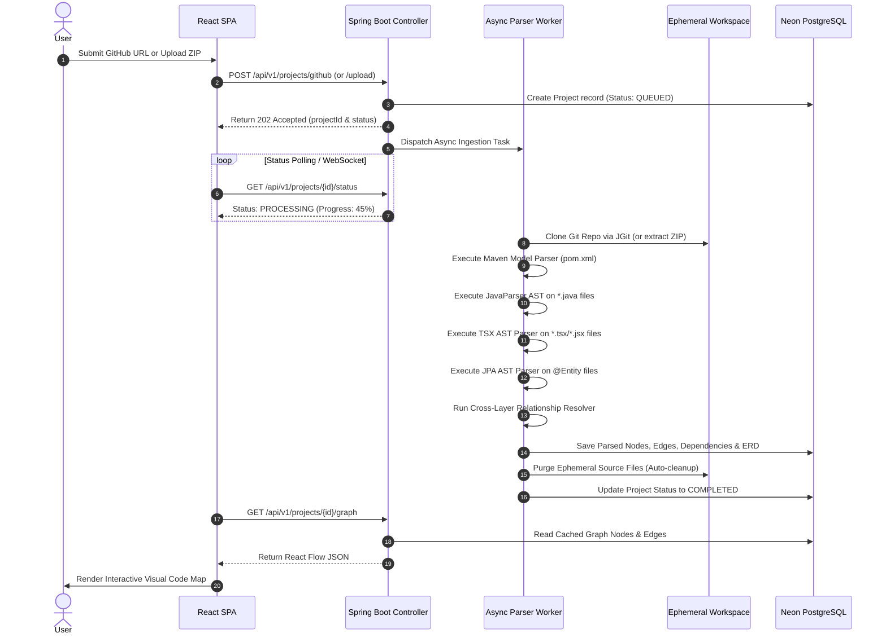

# CodeFlow Studio - High-Level Design (HLD)

This document describes the high-level architecture, system topology, component interactions, and data flow pipelines for **CodeFlow Studio**.

---

## 1. System Architecture Topology

```
+-----------------------------------------------------------------------------------+
|                                 CLIENT LAYER                                      |
|                                                                                   |
|  +-----------------------------------------------------------------------------+  |
|  |                 React 19 + TypeScript SPA (Cloudflare Pages)                |  |
|  |  +------------------+  +--------------------+  +-------------------------+  |  |
|  |  |  React Flow Graph|  | Monaco Code Editor |  | Component & ER Inspector|  |  |
|  |  +------------------+  +--------------------+  +-------------------------+  |  |
|  +-----------------------------------------------------------------------------+  |
+------------------------------------------+----------------------------------------+
                                           |
                                     HTTPS | REST API / WebSockets
                                           v
+-----------------------------------------------------------------------------------+
|                             BACKEND ENGINE LAYER                                  |
|                                                                                   |
|  +-----------------------------------------------------------------------------+  |
|  |                     Spring Boot 3.2 Backend Service                         |  |
|  |                                                                             |  |
|  |  +-------------------------+            +--------------------------------+  |  |
|  |  | Ingestion Controller    |            | Async Analysis Task Executor   |  |  |
|  |  +------------+------------+            +---------------+----------------+  |  |
|  |               |                                         |                   |  |
|  |               v                                         v                   |  |
|  |  +-------------------------+            +--------------------------------+  |  |
|  |  | Git / ZIP Fetcher       |            | Multi-Language Static Parser   |  |  |
|  |  | (JGit / ZipInputStream) |            | - Maven Model Parser           |  |  |
|  |  +------------+------------+            | - JavaParser (AST Builder)     |  |  |
|  |               |                         | - React TypeScript AST Parser  |  |  |
|  |               v                         +---------------+----------------+  |  |
|  |  +-------------------------+                            |                   |  |
|  |  | Ephemeral Workspace Scratch|                            v                   |  |
|  |  | (Auto-cleaned after parse)|            +--------------------------------+  |  |
|  |  +-------------------------+            | Relationship Graph Resolver    |  |  |
|  |                                         +---------------+----------------+  |  |
|  +---------------------------------------------------------|-------------------+  |
+------------------------------------------------------------|----------------------+
                                                             |
                                                             v
+-----------------------------------------------------------------------------------+
|                                 DATA LAYER                                        |
|                                                                                   |
|  +-----------------------------------------------------------------------------+  |
|  |                   Neon PostgreSQL Relational Database                       |  |
|  |  - Project Metadata       - Nodes & Edges          - ER Schema Tables       |  |
|  |  - Dependencies           - Full Graph JSON        - User Preferences       |  |
|  +-----------------------------------------------------------------------------+  |
+-----------------------------------------------------------------------------------+
```

---

## 2. End-to-End Data Flow Pipeline



---

## 3. Core Component Breakdown

### 3.1 Ingestion Service
- Accepts git repository URLs or multipart ZIP files.
- Employs strict path sanitization to prevent path traversal vulnerability (`zipEntry.getName().contains("..")`).
- Interacts with **Ephemeral Scratch Volume** to write extracted source files temporarily.

### 3.2 Static Parsing Engine
- **Maven Parser**: Inspects `pom.xml` using `org.apache.maven:maven-model` to capture Spring Boot versions, starters, and dependency trees.
- **Java AST Parser**: Leverages `com.github.javaparser:javaparser-symbol-solver-core` to scan annotations (`@RestController`, `@Service`, `@Repository`, `@Entity`), methods, variables, and cross-class imports.
- **React Parser**: Leverages Node.js CLI script or Regex/AST regex-based AST scanner to parse TypeScript React components, routes, state hooks, and HTTP API clients (`axios.get/post`).

### 3.3 Relationship Graph Resolver Engine
Matches backend REST endpoints to frontend API calls via heuristic path matching:
1. Extract Spring Controller request mapping path: e.g., `@RequestMapping("/api/users")` + `@GetMapping("/{id}")` $\rightarrow$ `GET /api/users/{id}`.
2. Extract React client HTTP invocation path: e.g., `axios.get('/api/users/' + userId)` $\rightarrow$ regex match `GET /api/users/{id}`.
3. Establish directed graph edge: `[ReactComponent.tsx] -> [GET /api/users/{id}] -> [UserController.java] -> [UserService.java] -> [UserRepository.java] -> [users Table]`.

### 3.4 Storage & Graph Renderer
- Stores final graphs in Neon PostgreSQL as normalized tables (`project_nodes`, `project_edges`, `project_dependencies`) and as a denormalized JSON payload for fast client retrieval.
- Frontend uses **React Flow** with custom SVG node types for visually distinctive layer rendering.
